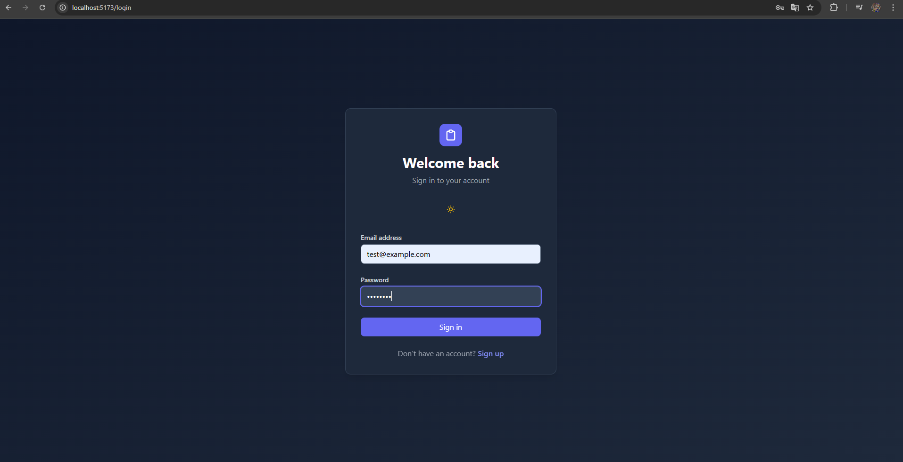
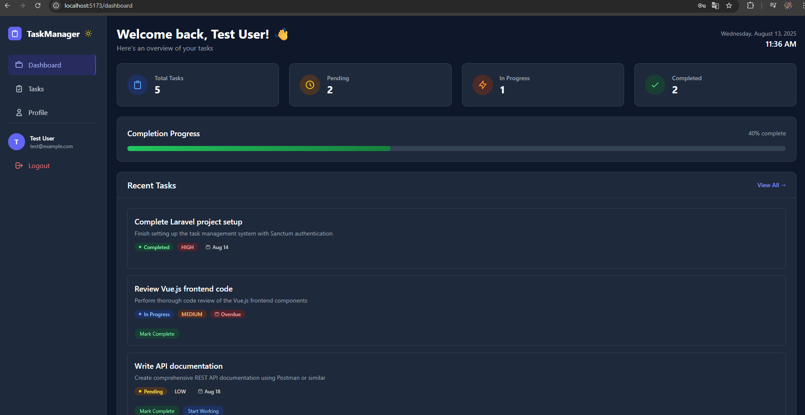
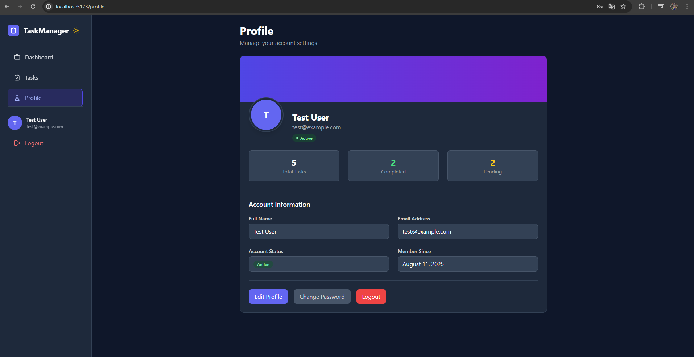

# 📋 Task Management System

A modern, full-stack task management application built with Vue.js and Laravel, featuring user authentication, CRUD operations, and a beautiful dark/light theme system.






## ✨ Features

### 🔐 Authentication & Security
- **User Registration & Login** with secure authentication
- **JWT Token-based Authentication** using Laravel Sanctum
- **Protected Routes** with automatic redirects
- **Session Management** with persistent login state

### 📊 Task Management
- **Create, Read, Update, Delete** tasks with full CRUD operations
- **Task Prioritization** (Low, Medium, High)
- **Status Tracking** (Pending, In Progress, Completed)
- **Due Date Management** with overdue detection
- **Advanced Filtering** by status, priority, and due date
- **Real-time Search** functionality

### 🎨 User Interface
- **Modern, Responsive Design** with Tailwind CSS
- **Dark/Light Theme Toggle** with system preference detection
- **Smooth Animations** and hover effects
- **Interactive Dashboard** with task statistics
- **Progress Visualization** with completion rates
- **Mobile-Friendly** responsive layout

### 📈 Dashboard & Analytics
- **Task Statistics** overview (total, pending, completed)
- **Completion Progress** tracking
- **Recent Activity** display
- **Quick Actions** for task management

## 🛠️ Tech Stack

### Frontend
- **Vue.js 3** - Progressive JavaScript framework
- **Vue Router** - Client-side routing
- **Pinia** - State management
- **Axios** - HTTP client for API calls
- **Tailwind CSS** - Utility-first CSS framework

### Backend
- **Laravel 12** - PHP web framework
- **Laravel Sanctum** - API authentication
- **MySQL** - Relational database
- **Eloquent ORM** - Database abstraction layer

### Development Tools
- **Vite** - Build tool and dev server
- **Composer** - PHP dependency manager
- **npm** - Node.js package manager

## 📁 Project Structure

```
task-management-system/
├── task-management-frontend/          # Vue.js Frontend
│   ├── src/
│   │   ├── components/
│   │   │   ├── layout/
│   │   │   │   └── AppNavbar.vue
│   │   │   └── tasks/
│   │   │       ├── TaskCard.vue
│   │   │       ├── TaskFilters.vue
│   │   │       └── TaskModal.vue
│   │   ├── stores/
│   │   │   ├── auth.js
│   │   │   ├── tasks.js
│   │   │   └── theme.js
│   │   ├── views/
│   │   │   ├── auth/
│   │   │   │   ├── LoginView.vue
│   │   │   │   └── RegisterView.vue
│   │   │   ├── DashboardView.vue
│   │   │   ├── TasksView.vue
│   │   │   └── ProfileView.vue
│   │   ├── services/
│   │   │   └── api.js
│   │   └── router/
│   │       └── index.js
│   ├── tailwind.config.cjs
│   └── package.json
└── task-management-backend/           # Laravel Backend
    ├── app/
    │   ├── Http/
    │   │   └── Controllers/
    │   │       ├── AuthController.php
    │   │       ├── TaskController.php
    │   │       └── CategoryController.php
    │   └── Models/
    │       ├── User.php
    │       ├── Task.php
    │       └── Category.php
    ├── database/
    │   ├── migrations/
    │   └── seeders/
    ├── routes/
    │   └── api.php
    └── composer.json
```

## 🚀 Getting Started

### Prerequisites

- **Node.js** (v18 or higher)
- **PHP** (v8.2 or higher)
- **Composer**
- **MySQL**

### Installation

1. **Clone the repository**
   ```bash
   git clone https://github.com/AlvaroMillanEstevez/task-management-system.git
   cd task-management-system
   ```

2. **Backend Setup (Laravel)**
   ```bash
   cd task-management-backend
   
   # Install dependencies
   composer install
   
   # Create environment file
   cp .env.example .env
   
   # Generate application key
   php artisan key:generate
   
   # Configure database in .env
   DB_DATABASE=task_management
   DB_USERNAME=your_username
   DB_PASSWORD=your_password
   
   # Install Sanctum
   php artisan install:api
   
   # Run migrations and seeders
   php artisan migrate --seed
   
   # Start the server
   php artisan serve
   ```

3. **Frontend Setup (Vue.js)**
   ```bash
   cd ../task-management-frontend
   
   # Install dependencies
   npm install
   
   # Start development server
   npm run dev
   ```

4. **Access the application**
   - Frontend: http://localhost:5173
   - Backend API: http://localhost:8000/api

### Default Login Credentials

```
Email: test@example.com
Password: password
```

## 📡 API Endpoints

### Authentication
```
POST /api/auth/register    # User registration
POST /api/auth/login       # User login
GET  /api/auth/me          # Get current user
POST /api/auth/logout      # User logout
POST /api/auth/refresh     # Refresh token
```

### Tasks
```
GET    /api/tasks          # Get all tasks (with filters)
POST   /api/tasks          # Create new task
GET    /api/tasks/{id}     # Get specific task
PUT    /api/tasks/{id}     # Update task
DELETE /api/tasks/{id}     # Delete task
```

### Categories
```
GET    /api/categories     # Get all categories
POST   /api/categories     # Create category
PUT    /api/categories/{id} # Update category
DELETE /api/categories/{id} # Delete category
```

## 🎨 Theme System

The application features a comprehensive dark/light theme system:

- **Automatic Detection** - Respects system preference
- **Manual Toggle** - Switch themes with a button click
- **Persistent Storage** - Remembers user preference
- **Smooth Transitions** - Animated theme changes
- **Complete Coverage** - All components support both themes

## 📱 Responsive Design

- **Mobile-First** approach with Tailwind CSS
- **Responsive Grid** layouts for different screen sizes
- **Touch-Friendly** interfaces for mobile devices
- **Adaptive Navigation** that works across devices

## 🔒 Security Features

- **CSRF Protection** with Laravel Sanctum
- **API Rate Limiting** to prevent abuse
- **Input Validation** on both frontend and backend
- **Secure Password Hashing** with bcrypt
- **Token-Based Authentication** for stateless API

## 🧪 Testing

```bash
# Backend tests
cd task-management-backend
php artisan test

# Frontend tests (if implemented)
cd task-management-frontend
npm run test
```

## 📦 Build for Production

```bash
# Frontend build
cd task-management-frontend
npm run build

# Backend optimization
cd task-management-backend
php artisan config:cache
php artisan route:cache
php artisan view:cache
```

## 🌟 Key Features Showcase

### Dashboard Analytics
- Real-time task statistics
- Progress tracking with visual indicators
- Recent activity timeline
- Quick action buttons

### Advanced Task Management
- Drag-and-drop functionality (future enhancement)
- Task categorization
- Due date notifications
- Bulk operations (future enhancement)

### User Experience
- Intuitive interface design
- Fast and responsive interactions
- Consistent design language
- Accessibility considerations

## 🔮 Future Enhancements

- [ ] **Real-time Notifications** with WebSockets
- [ ] **Team Collaboration** features
- [ ] **File Attachments** for tasks
- [ ] **Calendar Integration**
- [ ] **Email Notifications**
- [ ] **Task Templates**
- [ ] **Advanced Analytics** and reporting
- [ ] **Mobile App** (React Native/Flutter)
- [ ] **Docker Containerization**
- [ ] **CI/CD Pipeline** setup

## 🤝 Contributing

1. Fork the repository
2. Create a feature branch (`git checkout -b feature/amazing-feature`)
3. Commit your changes (`git commit -m 'Add some amazing feature'`)
4. Push to the branch (`git push origin feature/amazing-feature`)
5. Open a Pull Request

## 📄 License

This project is licensed under the MIT License - see the [LICENSE](LICENSE) file for details.

## 👨‍💻 Author

**Your Name**
- Portfolio: [AlvaroMillanEstevez](https://alvaromillanestevez.github.io)
- LinkedIn: [linkedin.com/AlvaroMillanEstevez](https://www.linkedin.com/in/alvaro-millan-estevez-27b814375/)
- GitHub: [@AlvaroMillanEstevez](https://github.com/AlvaroMillanEstevez)

## 🙏 Acknowledgments

- Laravel community for the excellent framework
- Vue.js team for the progressive framework
- Tailwind CSS for the utility-first CSS framework
- All open-source contributors who made this project possible

---

⭐ **If you found this project helpful, please give it a star!** ⭐